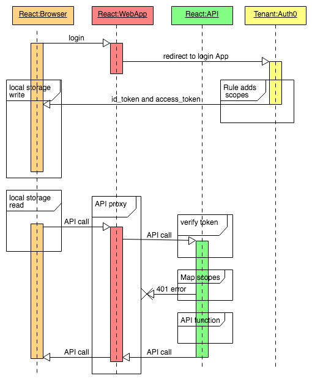
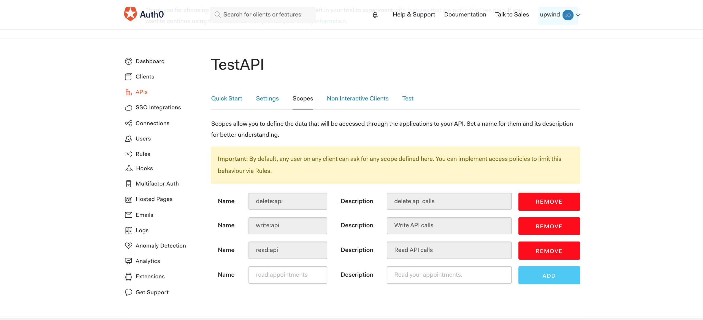
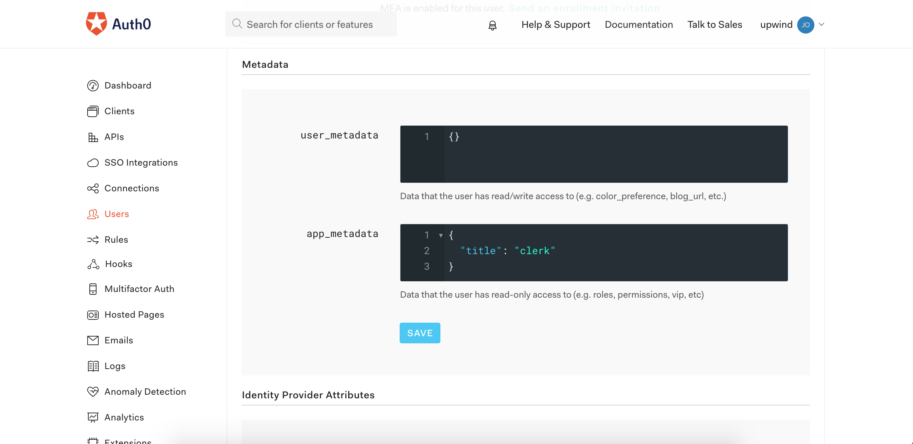
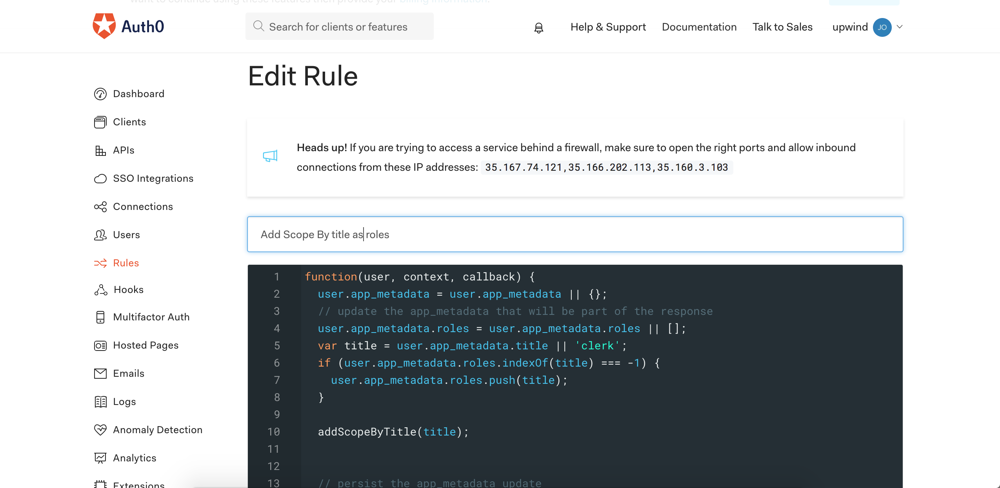
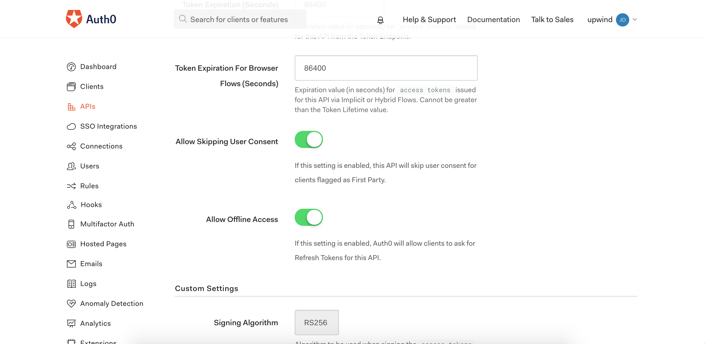
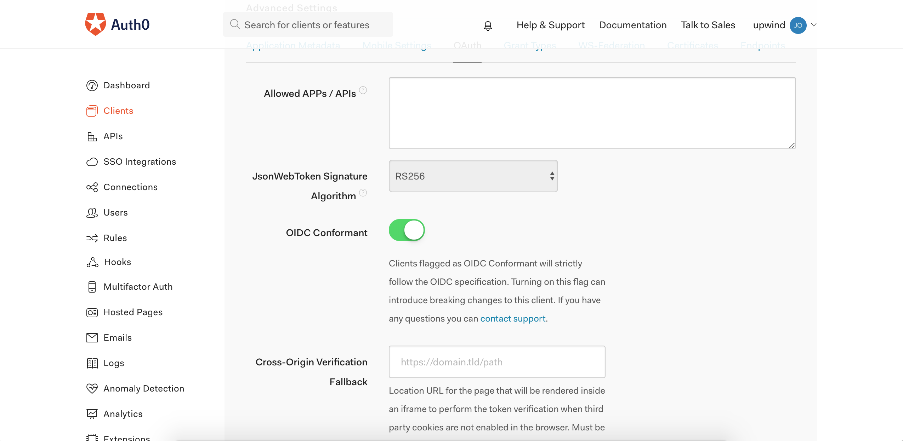
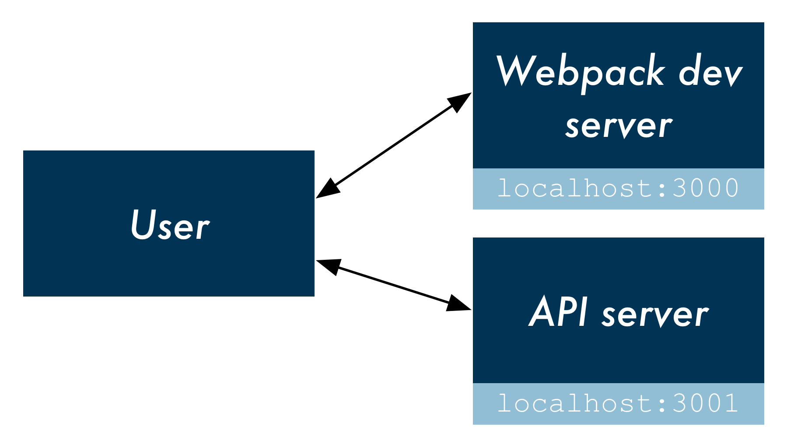

# Auth0 React Login and API Authorization

This sample demonstrates how to add authentication to a React application with Auth0. The sample makes use of Auth0's hosted login page which provides centralized authentication. This solution allows a customer to define limited access to their API based on the title of the user.

## Getting Started

Clone the repo or download it.
The application points to a sample **Auth0** `upwind` tenant which is configured to work with the example.

```bash
npm install
```

### Start the app together with the API
The development server that comes with create-react-app can be used to serve the application.
The application will be served at `http://localhost:3000`.

 Additionally the API server is listening on `http://localhost:3001` 

```bash
npm run start:dev-all
```
### Start the app in development mode together with the API server
```bash
npm run start:all
```
### Start the only API in development mode
I included a [POSTMAN](./postman/auth0_api.postman_collection.json)  collection for testing the API.
```bash
npm run start:dev-api
```
The access_token can be obtained by printing it out in the javascript console and then configured in the`POSTMAN` environment settings.

> **Note:** In development mode - determined by the environment variable `NODE_ENV=development` - the app will use the local public key `./keys/public.pem` file rather than retrieving `./jwks.json` from the tenant server.
This is especially helpful if your corporate firewall's SSL inspection policy creates self-signed TLS issues.

### Pre-configured users / password:
The following users were pre-configured in the Upwind tenant: 

clerk@mailinator.com /  clerk12345!  
title=clerk, read permission

manager@mailinator.com / manager12345!  
title=manager, read,write permission


admin@mailinator.com / admin12345!  
title=admin, read,write, delete permission

## Authentication Flow
The Client application invokes the authentication request and redirected to AUTH0's tenant for authentication. 
A configured rule adds custom scopes as permissions to the `access_token`  depending on the user' title.

After successful authentication Auth0 redirects a callback to the client application.
The 'id_token' and 'access_token' are stored in the browser's local storage.



For API ajax calls the base64 encoded (JWT) access_token is retrieved out of the local storage and added to the http `Authorization` header field as a `Bearer` token.

```javascript
'Authorization': 'Bearer <token>'
```

The React server app proxies all requests to the API.
Within the API, the JWT token is verified.
Custom middleware maps the custom scopes (permissions) to API routes.
The API function is executed or blocked and the response is sent back to the client.

----
## Auth0 Tenant configuration
The following configurations need to be performed in the **Auth0** [management application](https://manage.auth0.com) for the tenant.

### Configuring Custom Scopes for the API
Three custom scopes were added: read:api,write:api and delete:api




### Configuring User Roles and Permissions
For demonstration purposes each user was assigned a `title`  property in the app_metadata section of the user's configuration.  Alternatively the title property could have been retrieved from another source,e.g. profile attributes in LDAP, database etc.




### Title to Role mapping
The Authorization is accomplished by adding custom scopes to the access_token depending on the title of the user.
For demonstration purposes the title of the user is retrieved from the app_metadata properties. Currently 3 job titles are supported: `clerk`, `manager` and `admin`. 

Within the Auth0 manager application a custom rule was added which takes the title and maps the title to scopes which are included in the access_token.

clerk | manager | admin
--- | --- | ---
`read:api` |`read:api` | `read:api` 
| |`write:api` | `write:api` 
||| `delete:api` 

In the Rules section of the management application add the custom [Rule](./rules/add_scopes_by_title.js) which adds the scopes to the access_token. Additionally the rule adds the `offline_access` scope for refreshing mobile tokens.



```javascript
...
function addScopeByTitle(title) {
    var scopes = [];

    if (title === 'admin') {
      scopes.push('delete:api');
      scopes.push('write:api');
      scopes.push('read:api');
    }
    if (title === 'clerk') {
      scopes.push('read:api');
    }
    if (title === 'manager') {
      scopes.push('write:api');
      scopes.push('read:api');
    }
    // add offline_access scope to allow refresh token for mobile
    scopes.push('offline_access');
    context.accessToken.scope = scopes;
  }
  ...
```
### Refresh token configuration
A few more settings are necessary to enable `Refresh Tokens` on the server.
Turn on `Allow Offline Access` in the APIs settings. 


IN the Advanced Settings, turn on `OIDC Conformant`.



----
## Application and API configuration
On the ckient side, the API calls are created inside `Home.js` after successful authentication by adding the 
`Authorization: Bearer <token>`
 header.

The following code adds the header to the API call:

```javascript
createHeader() {
    const at = localStorage.getItem('access_token');
    console.log('Access token from storage:' + at)
    return 'Bearer ' + at
  }

  // add authorization header to api call
  fetch(method, action) {

    return fetch(apiBaseUrl + "/" + action, {
      method,
      headers: {
        'Accept': 'application/json',
        'Content-Type': 'application/json',
        'Authorization': this.createHeader()
      }
    })
  }

```

### Proxying API calls
The API runs as a standalone application but the client's browser will not be able to access the API directly without generating errors.


 In production an edge router can be configured to point to the API server which serves up the API under the same domain.
In this example the client application calls the API by proxying the request through is application. This avoids a lot of CORS related permission issues.


***Further reading***: 
https://www.fullstackreact.com/articles/using-create-react-app-with-a-server/

### Mapping Scopes (Permission) to API routes
Authorization within the API after validating the JWT itself is accomplished by parsing the last path element out of the API's URI as the desired `action`. 

```javascript
// Example:
// action=`write`
app.post('/api/test/write', function (req, res) {
  console.log('Post request, write action success')
  return res.json(true)
});
```

The `action` is then matched with the  pre-defined scopes obtained from the access_token.

read | write | delete
--- | --- | ---
`read:api` |`read:api` | `read:api` 
 
The role mapping by scope is performed in the middleware implementation `scopeAuthorization.js`  for all requests.

```javascript
// scopeAuthorization.js
...
module.exports = () => (req, res, next) => {
  const { user, method, path } = req
  const pathSplit = path.split('/')
  const action = pathSplit[pathSplit.length - 1]
  if (user) {
    const { scope } = user
    if (scope) {
      const scopes = scope.split(' ')
      // convention: map write to path ending with 'read' 
      if (action === 'read' && scopes.includes('read:api')) {
        return next()
      }
      // convention: map write to path ending with 'write' 
      if (action === 'write' && scopes.includes('write:api')) {
        return next()
      }
      // convention: map delete to path ending with 'delete' 
      if (action === 'delete' && scopes.includes('delete:api')) {
        return next()
      }
    }
  }
  // unauthorized 
  return res.status(401).send('Unauthorized')
}
```
## Author

[Joern Freydank](mailto://joern@upwindconsulting.com)

## License

This project is licensed under the MIT license. See the [LICENSE](LICENSE.txt) file for more info.

